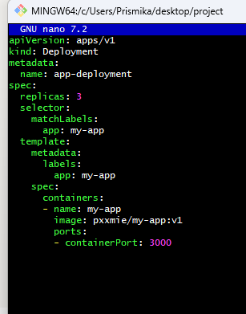

# Orchestrating web application with Kubernetes

### **Step 1: Creating Kubernetes Deployment**

**Create Deployment YAML file**: Begin by creating a Kubernetes Deployment YAML file named **`app-deployment.yml`** in your project directory. This file will contain specifications for your application deployment, including details like the container image, replicas, and any necessary configurations.

```bash
nano app-deployment.yml
```

```bash
apiVersion: apps/v1
kind: Deployment
metadata:
  name: app-deployment
spec:
  replicas: 3
  selector:
    matchLabels:
      app: my-app
  template:
    metadata:
      labels:
        app: my-app
    spec:
      containers:
      - name: my-app
        image: pxxmie/my-app:v1
        ports:
        - containerPort: 3000

```



 Use the **`kubectl apply`** command to apply the Deployment configuration to your Kubernetes cluster:

```bash
kubectl apply -f app-deployment.yml
```

### **Step 2: Exposing Your Application**

Create a Kubernetes Service YAML file `app-**service.yaml**` to expose your application to other services within the cluster. Specify the service type (e.g., ClusterIP, NodePort, LoadBalancer) and port mappings.

```bash
apiVersion: v1
kind: Service
metadata:
  name: app-service
spec:
  selector:
    app: my-app
  ports:
    - protocol: TCP
      port: 80
      targetPort: 3000
  type: NodePort

```


Apply the Service configuration to your Kubernetes cluster using the **`kubectl apply`** command:

```bash
kubectl apply -f app-service.yml
```

If the operation completes without errors, the Service should be successfully created in your Kubernetes cluster. You can verify this by running:

```bash
kubectl get services
```


### Step 3: Accessing the deployment

Once the Service is created and provisioned successfully, you can access your application via your local host followed by the specified port.


### **Step 4: Experimenting with Scaling**

Utilise the **`kubectl scale`** command to adjust the number of replicas for your application Deployment:

```bash
kubectl scale deployment app-deployment --replicas=3
```


This command scales the number of replicas to 3. You can modify the replica count as needed.

Confirm the scaling operation by using the **`kubectl get pods`** command to ensure that additional Pods have been created to match the desired replica count:

```bash
kubectl get pods
```


### **Error Handling**

During the deployment process with Kubernetes, encountering errors is not uncommon. Below are some common errors and steps to troubleshoot them:

**1. Image Pull Failures:**

Errors related to image pulling, such as **`ImagePullBackOff`** or **`ErrImagePull`**, may occur.

**Possible Causes:**

- Incorrect image name or tag specified in the deployment YAML file.
- Docker registry authentication issues.

Example: 


Run the following command to obtain more detailed information about the event:

```bash
kubectl describe pods app-deployment
```

