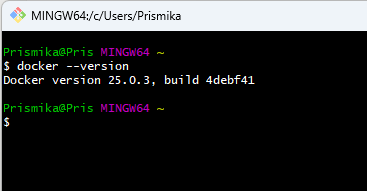

# Deploying a web application with Docker

In this project, I will be deploying a simple web application using Docker containers. As well as containerize the application, push it to Docker Hub, and run it as a Docker container on my local machine.

### Step 1:  **Set Up Docker**

Ensure that Docker is installed on your local machine or cloud server. Verify the installation by running the following command:

```bash
docker --version
```



If Docker is installed correctly, you'll see the Docker version displayed in the terminal.

### **Step 2: Set Up Your Project Directory and Create the Application**

Start by creating a new directory for your project and navigate into it:

```bash
mkdir project
cd project
```

Next, create a simple Node.js application file named **`app.js`** 

```bash
nano app.js 
```

Insert the following code into **`app.js`**:

```bash
// app.js

const http = require('http');

// Create a simple HTTP server
const server = http.createServer((req, res) => {
  // Set the response HTTP header with HTTP status and Content type
  res.writeHead(200, {'Content-Type': 'text/plain'});

  // Send the response body "Hello, World!"
  res.end('Hello, World!\n');
});

// Listen on port 3000 for incoming requests
const PORT = process.env.PORT || 3000;
server.listen(PORT, () => {
  console.log(`Server running at http://localhost:${PORT}/`);
});
```


This code sets up a basic HTTP server using Node.js that listens for incoming requests and responds with "Hello, World!".

### Step 3: Create a Dockerfile

To containerize your Node.js application, create a Dockerfile in your project directory:

```bash
nano Dockerfile
```

Insert the following content into your Dockerfile:

```bash
# Use the official Node.js image as base
FROM node:14

# Set the working directory inside the container
WORKDIR /usr/src/app

# Copy package.json and package-lock.json files
COPY package*.json ./

# Install dependencies
RUN npm install

# Copy the rest of the application code
COPY . .

# Expose port 3000 to the outside world
EXPOSE 3000

# Command to run the application
CMD ["node", "app.js"]

```


This Dockerfile sets up a container environment based on the official Node.js image from Docker Hub. It copies your application files into the container, installs dependencies using npm, exposes port 3000 (the port your Node.js application listens on), and specifies the command to run your application **`node app.js`**.

### Step 4: Build Docker Image

Build your Docker image using the following command:

```bash
 docker build -t pxxmie/my-app:v1 .
```

This command builds a Docker image tagged as **`pxxmie/my-app:v1`** based on the Dockerfile and application files in the current directory.


### **Step 5: Push the Image to Docker Hub**

Push your Docker image to Docker Hub with the following command:

```bash
docker push pxxmie/my-app:v1
```


This command pushes your Docker image to the specified repository on Docker Hub, making it available for deployment.

### Step 6: Verify in Docker Hub

After successfully pushing the image, verify its presence in Docker Hub by visiting the repository URL.


### **Step 7: Pull the Docker Image**

Before running the application, pull the Docker image from Docker Hub using the following command:

```bash
docker pull pxxmie/my-app:v1
```

This command retrieves the Docker image from Docker Hub to your local machine.


### Step 8: **Run the Docker Container**

Run a Docker container based on the pulled image with the following command:

```bash
docker run -d -p 3000:3000 pxxmie/my-app:v1
```

This command starts a container based on your Docker image and maps port 3000 of the container to port 3000 on your host machine.

### Step 9: **Test Your Application**

Open a web browser and navigate to **`http://localhost:3000`** to verify that your application is running correctly. You should see the "Hello, World!" message displayed in the browser.

Congratulations! You've successfully deployed your web application using Docker containers.


<aside>
💡 To stop all running containers, use the following command:

`docker stop $(docker ps -a -q)`

</aside>