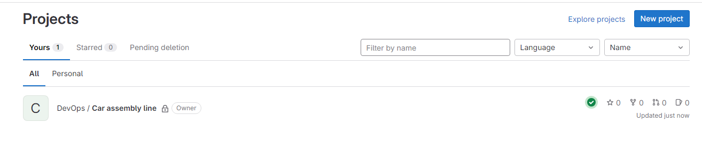

# GitLab - CI/CD pipeline

Using GitLab, I will be creating a project which I am simulating a simple car assembly process with a build and test pipeline.

I will create a simple pipeline with two stages build and test. 

### Step 1: Create a new project

- Create/ log into your GitLab account.
- Click on new project on the top right side of your homepage followed by create blank project.
  
    
  

- Give your project a name and click create project.

    

### Step 2: Add a new file to create Build job

- Once the project is created, navigate to the project's main page.
- Click on the "+" icon in the bar and select "New file.”

    

- Enter a file name, for example, **`.gitlab-ci.yml`**.

    

- In the editor, copy and paste the following content for the **`.gitlab-ci.yml`** file:

    ```yaml
    build the car:
    script:
        - mkdir build
        - cd build
        - touch car.txt
        - echo "chassis" > car.txt
        - echo "engine" > car.txt
        - echo "wheels" > car.txt
    ```

- Scroll down and click on the "Commit changes" button to save the file.
- On the left side bar click on jobs under build, you can see our first job has passed. If you click on the job you can see the running script. The tool running the script is GitHub runner - it runs the job and send the results back to GitLab.

    

    

The script in the "build the car" job creates a directory named "build," changes into that directory, and creates a file named "car.txt." It then writes "chassis," "engine," and "wheels" to the "car.txt" file, with each **`echo`** command overwriting the previous content. As a result, after the script is executed, "car.txt" contains only the last line, which is "wheels."

### Step 3: Adding test job

- Go back to the yml file and click on edit so we can add another job.

    

- I have added the stages section where it defines two stages for my CI/CD pipeline : build and test.

    ```yaml
    stages:
    - build 
    - test
    ```

- I have then specified the first job belongs to the build stage.
- I have added the second job which is Test stage (test the car).

    ```yaml
    test the car:
    stage: test
    script:
        - test -f build/car.txt
        - cd build
        - grep "chassis" car.txt
        - grep "engine" car.txt
        - grep "wheels" car.txt
    ```

    

- Scroll down and click on the "Commit changes" button to save the file.

### Step 4: Running the job and Debugging

- Lets go to jobs again in order to see if our second stage has passed or not.

    

    

- We can see that our job has failed and this is due to The "build the car" stage creates the "build" directory and the "car.txt" file. However, when the "test the car" stage starts, it doesn't have access to the "build" directory or the "car.txt" file because they are not persisted between stages. Therefore, we need to add artifacts in order to make communication between the two stages.

- Now, we can go back to our yml file in order to add the artifacts in order to share data between the two stages. Click commit changes.

    ```yaml
    stages:
    - build 
    - test

    build the car:
    stage: build
    script:
        - mkdir build
        - cd build
        - touch car.txt
        - echo "chassis" > car.txt
        - echo "engine" > car.txt
        - echo "wheels" > car.txt
    artifacts:
        paths:
        - build/

    test the car:
    stage: test
    script:
        - ls
        - test -f build/car.txt
        - cd build
        - cat car.txt
        - grep "chassis" car.txt
        - grep "engine" car.txt
        - grep "wheels" car.txt
    ```

    

- We can see that our test job has failed again. We can click into it to look into it more.

    

    

- Our script failed due to the use of the **`>`** operator, which overwrites the content of the file with each **`echo`** command. For example: **`echo "engine" > car.txt`**: This command, when executed, overwrites the content of "car.txt" with the string "engine." Now, "car.txt" only contains "engine," and the previous content ("chassis") is lost.
- We need to edit our yml file  by adding ‘>>’ operator.

    ```yaml
    stages:
    - build 
    - test

    build the car:
    stage: build
    script:
        - mkdir build
        - cd build
        - touch car.txt
        - echo "chassis" >> car.txt
        - echo "engine" >> car.txt
        - echo "wheels" >> car.txt
    artifacts:
        paths:
        - build/

    test the car:
    stage: test
    script:
        - ls
        - test -f build/car.txt
        - cd build
        - cat car.txt
        - grep "chassis" car.txt
        - grep "engine" car.txt
        - grep "wheels" car.txt
    ```

- This way, each **`echo`** command appends its content to the file, preserving the previous content and resulting in a file that contains all three lines: "chassis," "engine," and "wheels."

    

- Finally, we can see that both our build and test job has been successful.

    

    