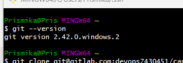
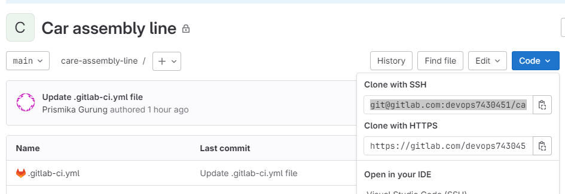
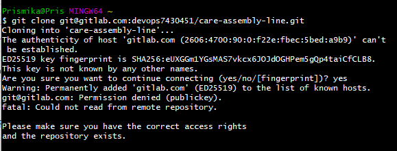
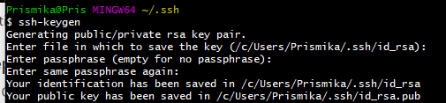
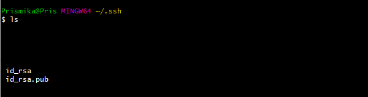
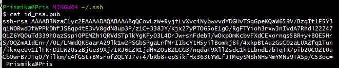
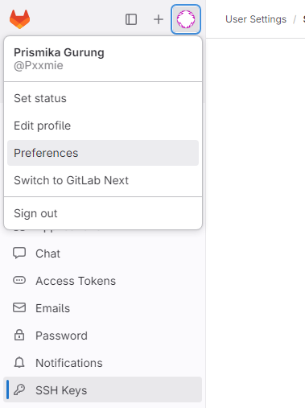
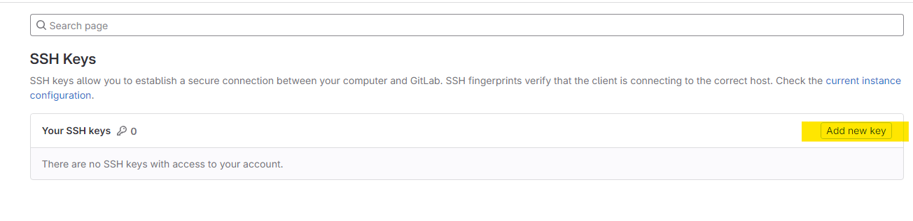
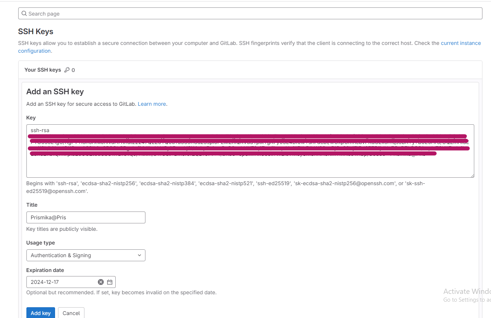
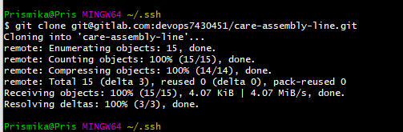

# GitLab- Setting up SSH key

### Step 1 - Install Git

- Open any terminal and check if you already have Git installed by typing:

    ```yaml
    git --version
    ```

    

### Step 2: Cloning GitLab repository

- Log in to your GitLab account and go to the repository you want to clone.
- Click on the Clone button and the address under Clone with SSH.

    

- Run the command on your terminal

    ```yaml
    git clone <ssh address>
    ```

    

- Getting this error is normal. We will need to generate a key to fix this. 

### Step 3: Generate an SSH key

- On your terminal run the following command in order to generate an SSH key.

    ```yaml
    ssh-keygen
    ```

    

- By default, your user folder will contain a folder called *`.ssh`*. Leave it as it is and hit the `Enter` key.
- If you go into your ssh folder, and run `ls` you should be able to see the keys generated.

    

- **`id_rsa`** — this is your **PRIVATE** key

- **`id_rsa.pub`** — this is your **PUBLIC** key.You can share it with others.

### Step 4: Adding your SSH Key to GitLab

- In your terminal, open your public key. You can use the cat command to view the contents of the file.

    ```bash
    cat id_rsa.pub
    ```

    

- Copy the entire contents of the file.
- In GitLab, click on your profile icon on the left hand side > click on edit profile > click on SSH keys on the side bar.

    

- Click on Add new key.

    

- Paste your **public key** in the big text box you see on the screen and finally click Add key.

    

### Step 5: ****Cloning GitLab repository (again)****

- Run the git clone command again.

    ```bash
    git clone <ssh address>
    ```

    

- Now Git is integrated, you can push and pull changes from GitLab without issues.