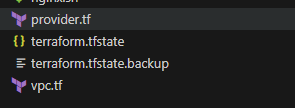

# Build AWS VPC, EC2 with Nginx using Terraform

In this project, I'll be using Terraform to set up an AWS Virtual Private Cloud (VPC) and launch an EC2 instance running Nginx. By automating the infrastructure setup and web server deployment, we'll have a secure and scalable environment ready to serve our content.

### Step 1: **Configure AWS Provider**

Before proceeding with creating resources in AWS, it's essential to configure the AWS provider in Terraform. This includes specifying the AWS region and, if necessary, authentication credentials.

Create a file named **`provider.tf`** and add the following content:

```bash
provider "aws" {
    region = "eu-west-1"
    profile = "prismika" # Optional if using named profiles
}
```

### **Step 2: Define VPC Configuration**

In this step, let's define the configuration for your Virtual Private Cloud (VPC). This includes specifying the CIDR block for the VPC and enabling DNS support and hostnames.

Create a file named **`vpc.tf`** and add the following configuration:

```bash
# Define the AWS VPC
resource "aws_vpc" "test-vpc" {
    # Specify the CIDR block for the VPC
    cidr_block = "10.0.0.0/16"
    
    # Enable DNS support for the VPC
    enable_dns_support = true
    
    # Enable DNS hostnames for the VPC
    enable_dns_hostnames = true

    # Add tags to the VPC for identification
    tags = {
        Name = "test-vpc"
    }
}
```

### Step 3: **Create Subnets**

In this step, we'll create both public and private subnets within the VPC.

**Public Subnet:**

```bash
# Define the public subnet within the VPC
resource "aws_subnet" "public-subnet" {
    # Associate the public subnet with the VPC using its ID
    vpc_id            = aws_vpc.test-vpc.id
    
    # Specify the CIDR block for the public subnet
    cidr_block        = "10.0.2.0/24"
    
    # Specify the availability zone for the public subnet
    availability_zone = "eu-west-1a"

	  # Ensure that instances launched in this subnet will have public IP addresses
    map_public_ip_on_launch = true

    # Add tags to the public subnet for identification
    tags = {
        Name = "public-subnet"
    }
}
```

**Private Subnet:**

```bash
# Define the private subnet within the VPC
resource "aws_subnet" "private-subnet" {
    # Associate the private subnet with the VPC using its ID
    vpc_id            = aws_vpc.test-vpc.id
    
    # Specify the CIDR block for the private subnet
    cidr_block        = "10.0.3.0/24"
    
    # Specify the availability zone for the private subnet
    availability_zone = "eu-west-1b"

    # Add tags to the private subnet for identification
    tags = {
        Name = "private-subnet"
    }
}
```

*`You should now have two .tf files; “provider.tf” and “vpc.tf”`*



### Step 4: **Establish Internet Gateway**

Create an Internet Gateway to enable your VPC to connect to the internet. Create ***network.tf:***

```bash
# create an IGW (Internet Gateway)
# It enables your vpc to connect to the internet
resource "aws_internet_gateway" "test-igw" {
    vpc_id = aws_vpc.test-vpc.id

    tags = {
        Name = "test-igw"
    }
}
```

### Step 5: **Define Route Table**

Next, let's create a custom route table for the public subnet to enable internet access.

**Define Route Table Configuration:**

```bash
# Define a route table for the public subnet
resource "aws_route_table" "public-rt" {
    vpc_id = aws_vpc.test-vpc.id

    route {
        cidr_block = "0.0.0.0/0"
        gateway_id = aws_internet_gateway.test-igw.id
    }

    tags = {
        Name = "public-rt"
    }
}
```

### Step 6: **Associate Subnets with Route Table**

Associate the public subnet with the custom route table to enable internet access for resources within the subnet.

**Associate Subnet with Route Table:**

```bash
# Associate the public subnet with the public route table
resource "aws_route_table_association" "public-subnet-association" {
    subnet_id      = aws_subnet.public-subnet.id
    route_table_id = aws_route_table.public-rt.id
}
```

### Step 7: **Configure Security Group**

Create a security group to control inbound and outbound traffic for your EC2 instances.

**Security Group Configuration:**

```bash
# security group
resource "aws_security_group" "test-sg" {
  vpc_id = aws_vpc.test-vpc.id

  egress {
    from_port   = 0
    to_port     = 0
    protocol    = -1
    cidr_blocks = ["0.0.0.0/0"]
  }

  ingress {
    from_port   = 22
    to_port     = 22
    protocol    = "tcp"
    cidr_blocks = ["0.0.0.0/0"]
  }

  ingress {
    from_port   = 80
    to_port     = 80
    protocol    = "tcp"
    cidr_blocks = ["0.0.0.0/0"]
  }

  tags = {
    Name = "test-sg"
  }
}

```

### **Step 8: Create a userdata.tpl**

Create a file named **`userdata.tpl`** in your project directory with the following content:

This script will be used as user data for your EC2 instance. It automatically updates package repositories, installs Nginx, starts the Nginx service, and ensures that Nginx starts on boot.

```
#!/bin/bash

# Update package repositories and install Nginx
sudo yum update -y
sudo yum install -y nginx

# Start Nginx service
sudo systemctl start nginx

# Ensure Nginx starts on boot
sudo systemctl enable nginx
```

### **Step 8: Launch EC2 Instance**

Now, let's create an EC2 instance in the defined VPC and subnet. Add the following code to **`ec2.tf`**:

```bash
resource "aws_instance" "prisec2" {
  ami                    = "ami-062a49a8152e4c031"
  instance_type          = "t2.micro"
  key_name               = "prismikaec2"
  subnet_id              = aws_subnet.public-subnet.id
  vpc_security_group_ids = [aws_security_group.test-sg.id]
  associate_public_ip_address = true
  user_data = file("userdata.tpl")

  tags = {
    Name = "prisec2"
  }
}

```

### Step 9: Intalise Terraform

Run the following commands to initialise and plan the Terraform configuration:

```bash

terraform init
terraform plan
terraform apply
```

### **Step 10: Testing and Verifying**

After applying the Terraform configuration to create the EC2 instance and VPC, it's important to verify that the resources have been successfully provisioned in the AWS console.

1. **EC2 Instance Verification**:
- Log in to the AWS Management Console.
- Navigate to the EC2 dashboard.
- Verify that the EC2 instance named "prisec2" has been created with the specified configuration (AMI, instance type, etc.).
- Ensure that the instance is running and has the expected tags


1. **VPC Verification**:
- From the EC2 dashboard, navigate to the VPC dashboard.
- Verify that the VPC named "test-vpc" has been created with the specified CIDR block and tags.
- Check that the associated subnets, route tables, internet gateway (if applicable), and security groups are configured correctly.


